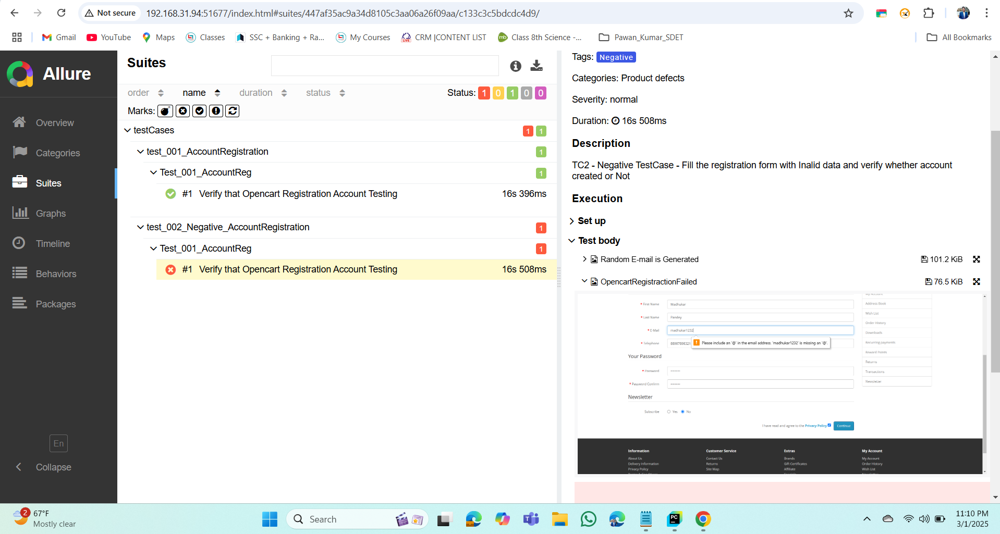
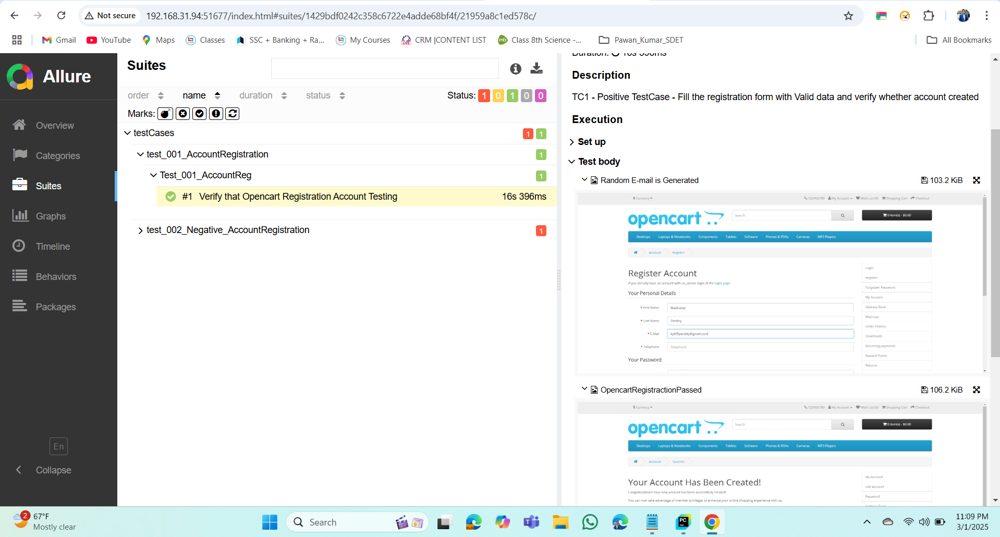

Web Automation Framework with POM in Python(Selenium)
Tech Stack
Python, PyTest
Selenium
Allure Report
Gitignore, PyTest Report
Page Object Model and Page Factory both
Highlight element while run
Parallel Run with xdist
MY SQL data base connect to verify data.
All the dependencies used
pip install allure-pytest selenium
pip install pytest selenium pytest-html openpyxl
pip install selenium-page-factory
pip install pyyaml faker openpyxl
pip install pytest-xdist
pip install mysql-connector-python
pip install pytest-reportportal
pip install python-dotenv
How to run the Framework?
pytest -n auto tests/opencart/pom/test_*

How to run Testcase parallel ?

